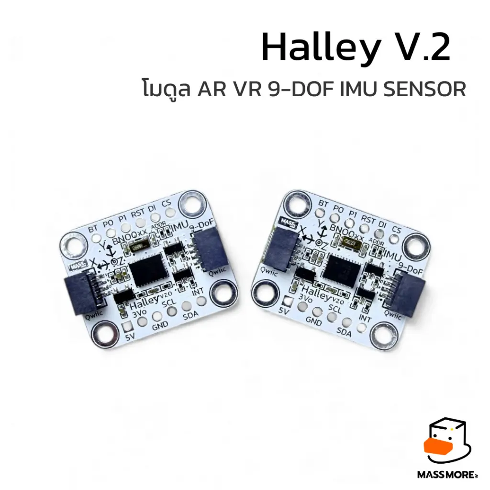
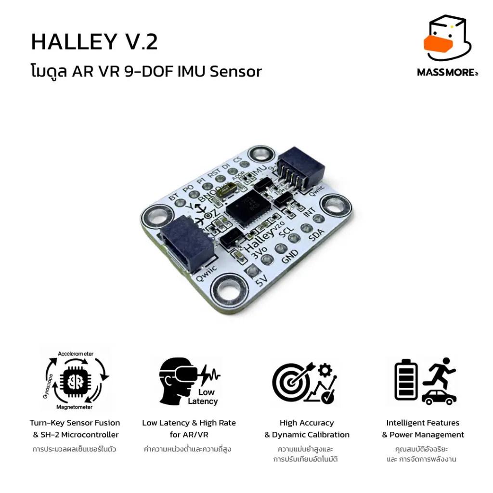
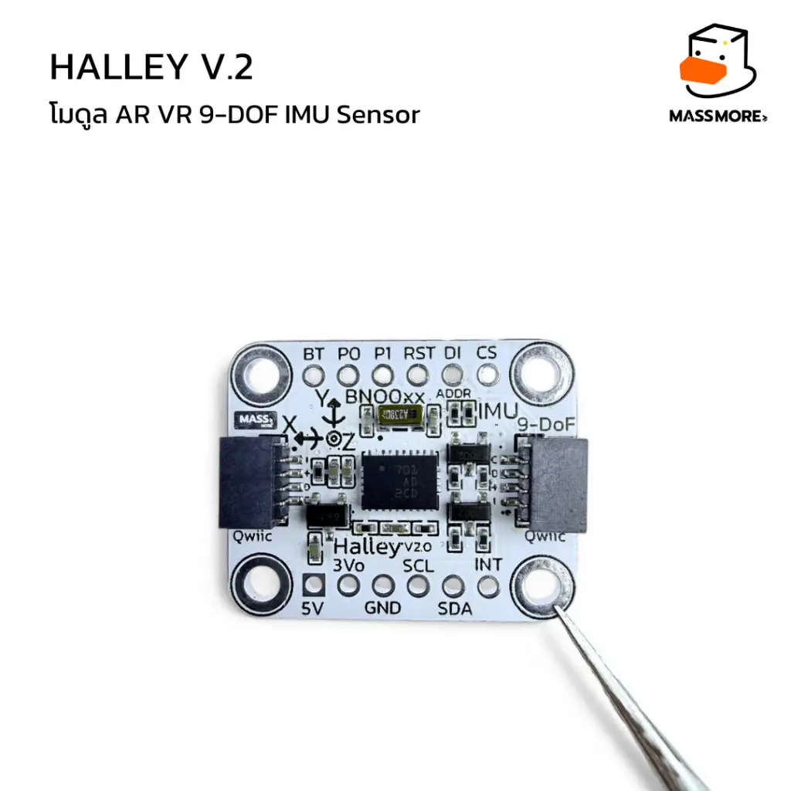
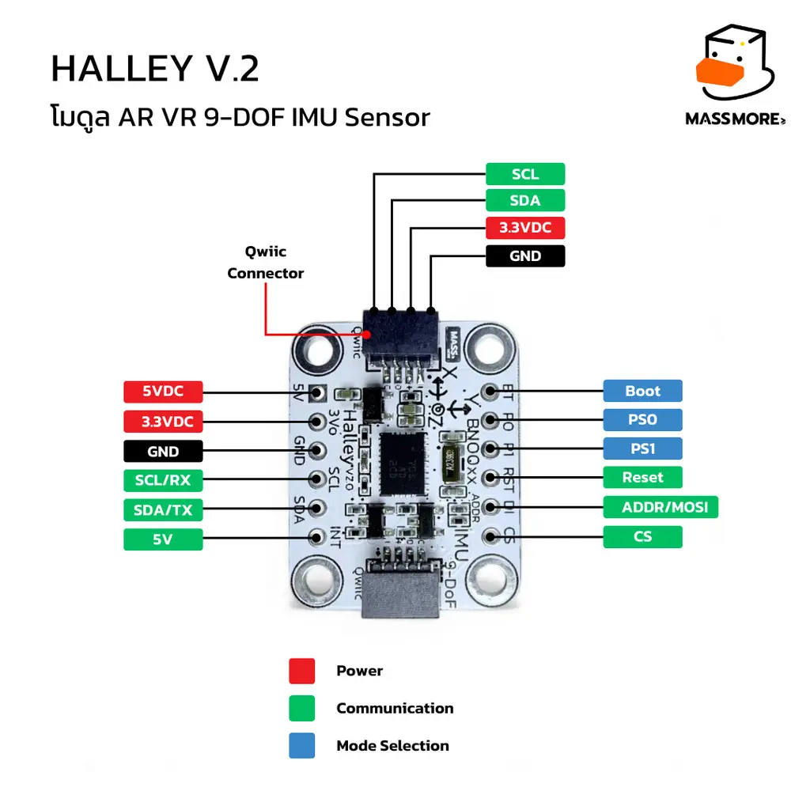
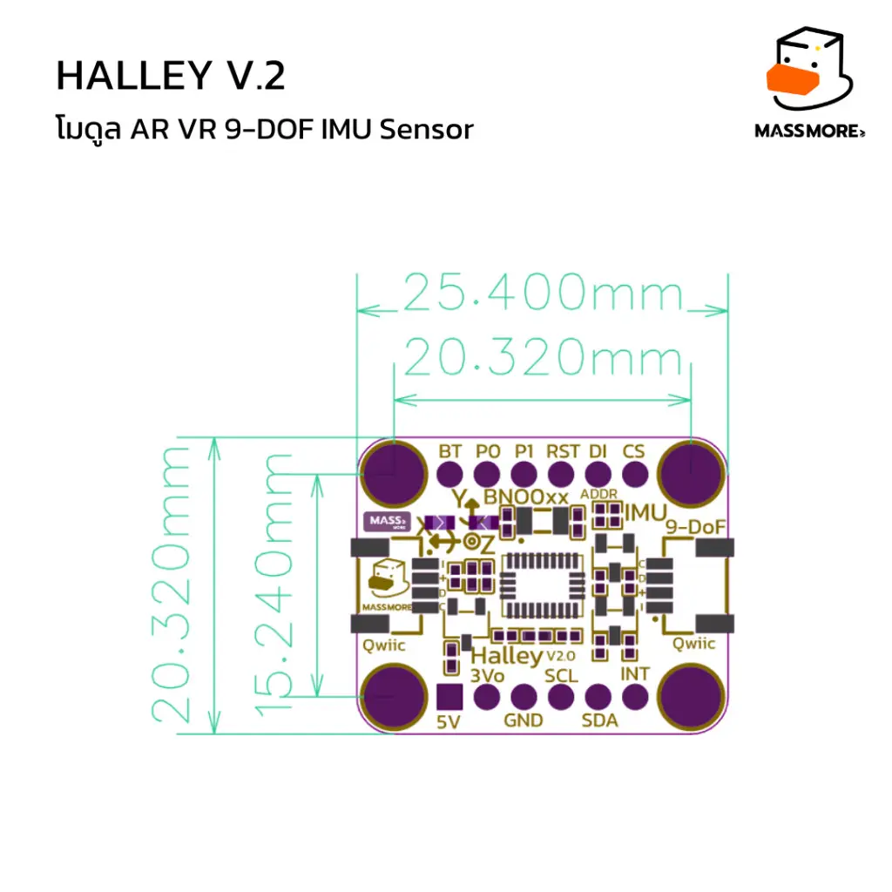
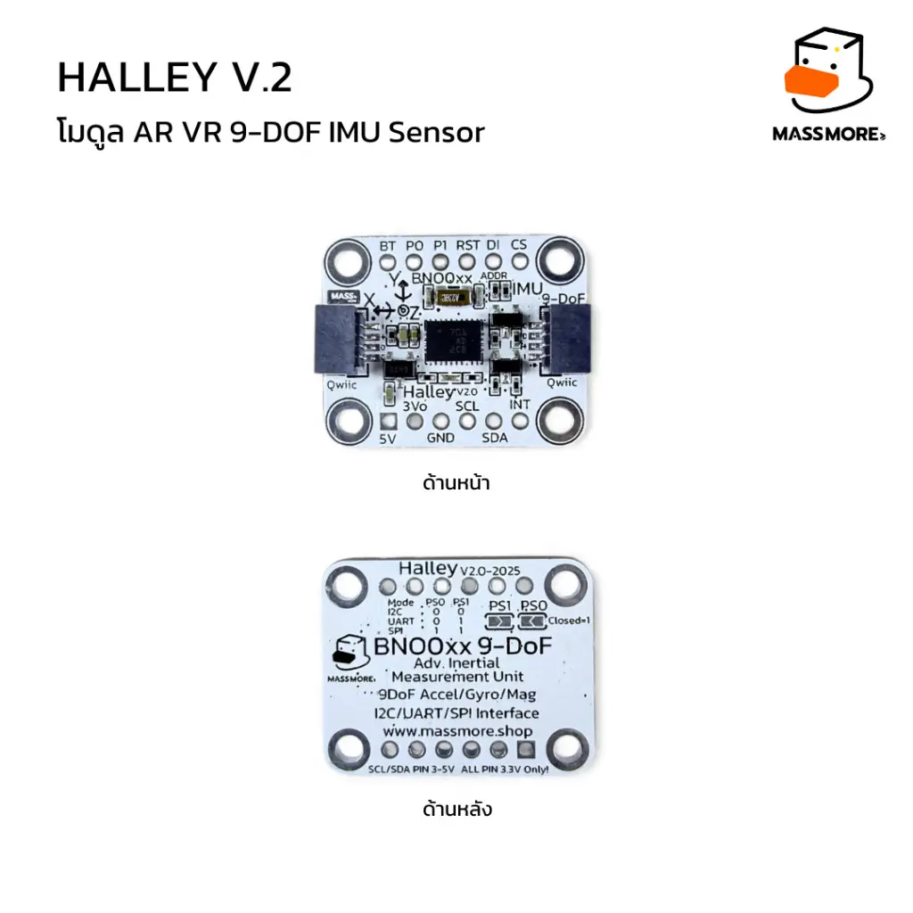
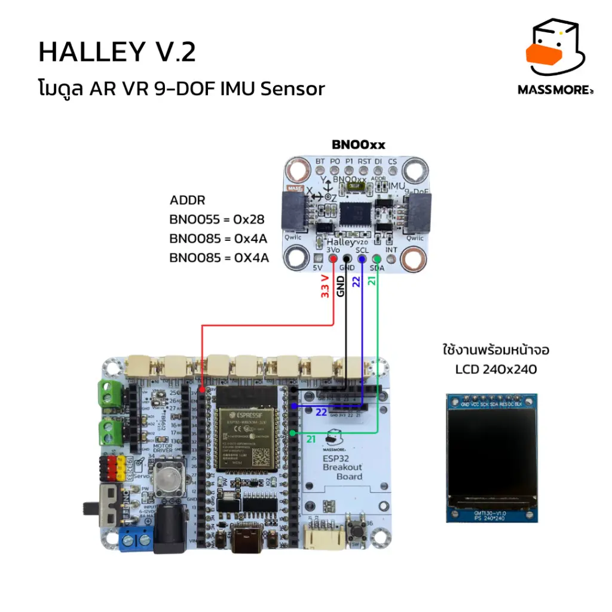

# Massmore_BNO08x

Arduino/PlatformIO library สำหรับโมดูล **Massmore Halley BNO085/BNO086** และ BNO08x family ใช้อ่าน quaternion, Euler angles, acceleration, gyroscope, magnetometer, activity/gesture reports รวมถึง calibration, tare, FRS และ UART-RVC



[](ArduinoIDE/LICENSE)
[](ArduinoIDE/CHANGELOG.md)
[](ArduinoIDE)
[](PlatformIO)

> **เริ่มต้นเร็วที่สุด:** ต่อแบบ I2C, จ่ายไฟ 3.3V, ใช้ address `0x4A` สำหรับโมดูล Massmore Halley แล้วเปิดตัวอย่าง `01_BasicRotationVector`

## Contents

- [Overview](#overview)
- [BNO085 vs BNO086](#bno085-vs-bno086)
- [Features](#features)
- [Product images and pinout](#product-images-and-pinout)
- [Repository structure](#repository-structure)
- [Hardware notes](#hardware-notes)
- [Quick Start: ESP32 + I2C](#quick-start-esp32--i2c)
- [Arduino IDE](#arduino-ide)
- [PlatformIO](#platformio)
- [Examples](#examples)
- [เฟิร์มแวร์สำเร็จรูป](#เฟิร์มแวร์สำเร็จรูป)
- [Common API](#common-api)
- [เลือก Rotation Vector](#เลือก-rotation-vector)
- [Calibration และ Tare](#calibration-และ-tare)
- [SPI, UART-SHTP และ UART-RVC](#spi-uart-shtp-และ-uart-rvc)
- [Troubleshooting](#troubleshooting)
- [References](#references)

## Overview

BNO085/BNO086 เป็น 9-DOF sensor-fusion SiP ที่รวม accelerometer, gyroscope, magnetometer, ARM Cortex-M0+ และเฟิร์มแวร์ CEVA SH-2 MotionEngine ไว้ในแพ็กเกจเดียว จึงประมวลผลทิศทางภายในเซ็นเซอร์และส่งผลเป็น quaternion หรือข้อมูลที่แปลงเป็น roll/pitch/yaw ได้ โดย host MCU ไม่ต้องเขียน Kalman/Madgwick filter เอง

Library นี้เป็น independent implementation ของ SH-2/SHTP รองรับ I2C, SPI, UART-SHTP และ UART-RVC ไม่มี external dependency และไม่ใช้ dynamic allocation

## BNO085 vs BNO086

BNO086 เป็น drop-in replacement ของ BNO085: pinout, host interfaces และ software feature set หลักเหมือนกัน ดังนั้น wiring, `begin()` และ report API ที่ใช้กับ BNO085 สามารถใช้กับ BNO086 ได้โดยไม่ต้องแยก code path

| หัวข้อ | BNO085 | BNO086 | การใช้งานจริง |
|---|---|---|---|
| Pinout และ shared SH-2 reports | รองรับ | รองรับ | ใช้ wiring และ API เดียวกัน |
| Accelerometer fusion | standard resolution | 14-bit accelerometer fusion | BNO086 ได้ resolution ใน fusion path เพิ่มขึ้นโดยไม่ต้องเปลี่ยนคำสั่งอ่าน report |
| Idle power ตาม CEVA test condition | ประมาณ 0.39 mW | ประมาณ 0.17 mW | BNO086 เหมาะกว่าเมื่อต้องอยู่ idle เป็นเวลานาน แต่ควรวัดทั้ง module ในวงจรจริงอีกครั้ง |
| Dynamic Calibration | รองรับ | รองรับ | ใช้ `calibrateAll()` และ `saveCalibration()` หรือ example `05_Calibration` ได้เหมือนกัน |
| Interactive Calibration | ไม่มี | เพิ่มเข้ามา | เป็น BNO086 capability; library v1.0.2 ยังไม่มี method ชื่อ Interactive Calibration โดยเฉพาะ |
| UART-RVC Motion Intent/Request | reserved | รองรับ | ใช้ example `12_UART_RVC` แล้วอ่าน `motionIntent` และ `motionRequest` จาก `massmore_rvc_data_t` |

ตัวอย่างอ่านค่า BNO086-only fields ใน UART-RVC:

```cpp
massmore_rvc_data_t data;

if (rvc.read(data)) {
  Serial.print("motionIntent=");
  Serial.print(data.motionIntent);
  Serial.print("  motionRequest=");
  Serial.println(data.motionRequest);
}
```

`MASSMORE_SENSOR_MOTION_REQUEST`, `MASSMORE_SENSOR_OPTICAL_FLOW` และ `MASSMORE_SENSOR_DEAD_RECKONING_POSE` ถูกประกาศเป็น BNO086-only report IDs ใน protocol definitions แต่ library v1.0.2 ยังไม่มี typed high-level enable/get API สำหรับ Optical Flow และ Dead Reckoning Pose จึงไม่ควรเขียนตัวอย่างโดยสมมติว่าเรียกใช้ได้แล้ว

> **เลือกแบบสั้น:** เลือก BNO085 เมื่อต้องการ shared orientation/motion reports และมีสินค้ารุ่นนี้อยู่แล้ว เลือก BNO086 สำหรับ design ใหม่ที่ต้องการ lower idle power, 14-bit accelerometer fusion หรือ BNO086-specific UART-RVC fields

## Features

- Rotation Vector, Game Rotation Vector, Geomagnetic Rotation Vector
- AR/VR Stabilized Rotation Vector และ Gyro-Integrated Rotation Vector สูงสุด 1 kHz
- Accelerometer, gyroscope, magnetometer, linear acceleration และ gravity
- Raw sensor reports พร้อม timestamp
- Step counter, step detector, tap, shake, flip, pickup, tilt, pocket และ circle detector
- Personal Activity Classifier และ Stability Classifier
- Dynamic calibration, Save DCD, clear calibration
- Tare เฉพาะแกนหรือทุกแกน พร้อม persist ลง FRS
- Product ID, serial number, FRS read/write และ chip-behavior verification
- Power mode, batching, callback และ multi-report
- ใช้หลายอ็อบเจกต์ได้ เช่น เซ็นเซอร์สองตัวที่ `0x4A` และ `0x4B`

อัตรารายงานสูงสุดตาม BNO08X Datasheet: Gyro Rotation Vector 1000 Hz, Rotation/Game RV 400 Hz, accelerometer 500 Hz, gyroscope 400 Hz และ magnetometer 100 Hz ทั้งนี้ไม่ควรเปิดทุก report ที่อัตราสูงสุดพร้อมกัน เพราะยังติดข้อจำกัดแบนด์วิดท์และกำลังประมวลผลของเซ็นเซอร์

## Product images and pinout

ภาพในส่วนนี้เป็นโมดูล **Massmore Halley V2, SKU1010** สำหรับ BNO085/BNO086 ดูรายละเอียดและตัวเลือกสินค้าปัจจุบันได้ที่ [Massmore product page](https://www.massmore.shop/products/2141d3bf-9d0f-4837-badf-a36bcda61638)

### Product overview





### Pinout



สำหรับ I2C ให้ใช้ `SCL`, `SDA`, `3Vo` และ `GND` ที่ Qwiic connector หรือ through-hole pads ด้านล่างของบอร์ด ขา `INT` และ `RST` แนะนำให้ต่อเข้ากับ ESP32 เพื่อให้ data-ready และ reset/recovery ทำงานได้สมบูรณ์ ส่วน `P0`, `P1`, `CS` และ `DI` ใช้สำหรับเลือก interface หรือกำหนดโหมดตามช่วง reset

ชื่อขาที่พิมพ์บนบอร์ดกับชื่อในเอกสารของ CEVA เทียบกันได้ตามนี้ — โค้ดและ README ทั้งชุดใช้**ชื่อบนบอร์ด**เป็นหลัก

| ขาบนบอร์ด | ชื่อในเอกสาร CEVA | หน้าที่ |
|---|---|---|
| `5V` | — | ไฟเข้า ผ่าน regulator XC6206 บนบอร์ด |
| `3Vo` | VDD / VDDIO | ไฟ 3.3V เข้าหรือออก |
| `GND` | GND | |
| `SDA` | SDA · TX (UART) · MISO (SPI) | ผ่าน level shifter 2N7002 |
| `SCL` | SCL · RX (UART) · SCK (SPI) | ผ่าน level shifter 2N7002 |
| `INT` | H_INTN | data ready, active-low, 3.3V |
| `RST` | NRST | reset, active-low, 3.3V |
| `DI` | ADDR / SA0 (I2C) · MOSI (SPI) | เลือก address หรือรับข้อมูลใน SPI, 3.3V |
| `CS` | H_CSN | chip select ของ SPI, 3.3V |
| `BT` | BOOTN | LOW ตอน reset = เข้า bootloader (DFU) |
| `P0` | PS0 | เลือกโหมด · ในโหมด SPI ทำหน้าที่ WAKE ด้วย |
| `P1` | PS1 | เลือกโหมด |

| โหมด | `P1` | `P0` |
|---|---|---|
| I2C | 0 | 0 |
| SPI | 1 | 1 |
| UART-SHTP | 1 | 0 |
| UART-RVC | 0 | 1 |

`P0`/`P1` ถูกอ่านตอนปล่อย `RST` เท่านั้น เปลี่ยนระหว่างที่ชิปทำงานอยู่ไม่มีผล

> **ข้อควรระวัง:** มีเพียง `SDA` กับ `SCL` ที่ผ่าน level shifter 2N7002 บนบอร์ด ขา signal ที่เหลือ (`INT`, `RST`, `DI`, `CS`, `BT`, `P0`, `P1`) เป็น logic 3.3V ล้วน ห้ามป้อน 5V เข้าขาเหล่านี้

### Dimensions and board views





ขนาดบอร์ดประมาณ **25.40 × 20.32 mm** ระยะศูนย์กลางรูยึดแนวนอนประมาณ **20.32 mm** และแนวตั้งประมาณ **15.24 mm** ควรตรวจไฟล์ mechanical drawing หรือวัดบอร์ด revision จริงอีกครั้งก่อนออกแบบ enclosure

### ESP32 I2C wiring example



ตัวอย่างในภาพใช้ `SDA = GPIO 21`, `SCL = GPIO 22`, ไฟ 3.3V และกราวด์ร่วม ค่า address เริ่มต้นของ Massmore Halley BNO085/BNO086 คือ `0x4A`; หากไม่พบอุปกรณ์ให้ตรวจตำแหน่งขา `DI` และลอง `0x4B`

## Repository structure

```text
Massmore_BNO08x/
├── ArduinoIDE/
│   ├── src/                     ไลบรารี Arduino
│   ├── examples/                ตัวอย่าง 16 ชุด
│   ├── test/                    host-side parser tests
│   ├── library.properties
│   └── keywords.txt
├── PlatformIO/
    ├── lib/Massmore_BNO08x/     ไลบรารีแบบ project-local
    ├── src/main.cpp             ตัวอย่างพร้อม build/upload
    ├── examples/                ตัวอย่าง 16 ชุดแบบ main.cpp
    └── platformio.ini           environment สำหรับ ESP32 หลายรุ่น
└── firmware/                    เฟิร์มแวร์ Factory Test ที่ build แล้ว (.bin แฟลชผ่านเว็บ)
```

เลือกแพ็กเกจให้ตรงกับเครื่องมือ:

| ใช้เครื่องมือ | เปิด/ติดตั้งจาก |
|---|---|
| Arduino IDE | `ArduinoIDE/` |
| VS Code + PlatformIO | เปิดโฟลเดอร์ `PlatformIO/` เป็นโปรเจกต์ |

## Hardware notes

### Supply voltage

สำหรับการเริ่มต้นให้ต่อขา `3Vo` ของโมดูล Massmore Halley กับ **3V3** ของ ESP32 (หรือจ่ายที่ขา `5V` แล้วให้ regulator บนบอร์ดจัดการ) และใช้ logic 3.3V เสมอ วิธีนี้ปลอดภัยกับทั้งชิปและสัญญาณ I2C

หน้าสินค้า Massmore ระบุว่าโมดูลรับไฟ 3.3–5V แต่สเปกชิป BNO08x กำหนด VDD 2.4–3.6V และ VDDIO 1.7–3.6V ความสามารถรับไฟ 5V จึงขึ้นกับวงจร regulator/level shifting ของบอร์ดโมดูล ไม่ใช่คุณสมบัติของชิปโดยตรง ขา `SDA`/`SCL` ผ่าน level shifter 2N7002 จึงต่อกับโฮสต์ 5V ได้ แต่ห้ามป้อน 5V เข้าขา `INT`, `RST`, `DI`, `CS`, `BT`, `P0`, `P1` ซึ่งเป็น 3.3V ล้วน

### I2C address

ตัวชิปรองรับ address `0x4A` เมื่อขา `DI` เป็น LOW และ `0x4B` เมื่อ `DI` เป็น HIGH โดยอ่านสถานะขานี้ตอน reset (`DI` คือขาที่ datasheet เรียกว่า SA0/ADDR)

- หน้าสินค้า Massmore Halley ระบุค่าเริ่มต้น `0x4A`
- macro `MASSMORE_BNO08X_I2C_ADDR_DEF` ในไลบรารีเวอร์ชัน 1.0.2 มีค่า `0x4B`

ดังนั้นตัวอย่างใน README นี้ใช้ `0x4A` ชัดเจน หากไม่พบเซ็นเซอร์ให้ลอง `0x4B` หรือรัน I2C scanner

### INT และ RST

- `INT/H_INTN` เป็น active-low และแนะนำให้ต่อ เพราะ host จะอ่านเมื่อมีข้อมูลจริง แทนการ poll บัสตลอดเวลา
- `RST/NRST` เป็น active-low และแนะนำให้ต่อ เพื่อให้ไลบรารีควบคุมการเริ่มต้นและ recovery ได้
- เริ่ม I2C ที่ 100 kHz ก่อน เมื่อระบบเสถียรแล้วจึงทดลอง 400 kHz

## Quick Start: ESP32 + I2C

### การต่อสายที่แนะนำ

| Massmore Halley V2 | ESP32 Dev Module | หมายเหตุ |
|---|---|---|
| `3Vo` | 3V3 | เริ่มต้นที่ 3.3V (หรือจ่ายที่ขา `5V`) |
| `GND` | GND | ต้องใช้กราวด์ร่วมกัน |
| `SDA` | GPIO 21 | เปลี่ยนได้ตามบอร์ด |
| `SCL` | GPIO 22 | เปลี่ยนได้ตามบอร์ด |
| `INT` | GPIO 4 | แนะนำ |
| `RST` | GPIO 5 | แนะนำ |
| `DI` | ไม่ต่อ | ปล่อยลอย = `0x4B` · ลง GND = `0x4A` |

> ESP32-S2/S3/C3/C6 อาจใช้พินไม่เหมือน ESP32 รุ่นคลาสสิก ตรวจ pinout ของบอร์ดและแก้ค่าคงที่ในโค้ดให้ตรงกับสายจริง

### โค้ดอ่าน roll, pitch, yaw

```cpp
#include <Wire.h>
#include <Massmore_BNO08x.h>

constexpr int SDA_PIN = 21;
constexpr int SCL_PIN = 22;
constexpr int INT_PIN = 4;
constexpr int RST_PIN = 5;
constexpr uint8_t BNO_ADDR = 0x4A;  // Massmore Halley; ลอง 0x4B หากไม่พบ

MassmoreBNO08x imu;
uint32_t lastPrintMs = 0;

void setup() {
  Serial.begin(115200);
  while (!Serial && millis() < 3000) {}

  Wire.begin(SDA_PIN, SCL_PIN);
  Wire.setClock(100000);             // เริ่มที่ 100 kHz เพื่อความเสถียร

  if (!imu.begin(BNO_ADDR, Wire, INT_PIN, RST_PIN)) {
    Serial.print("BNO08x init failed: ");
    Serial.println(MassmoreBNO08x::statusToString(imu.getLastError()));
    while (true) delay(100);
  }

  if (imu.enableRotationVector(10000) != MASSMORE_OK) { // 10,000 us = 100 Hz
    Serial.println("Enable Rotation Vector failed");
    while (true) delay(100);
  }
}

void loop() {
  imu.updateAll();

  if (!imu.hasNewReport(MASSMORE_SENSOR_ROTATION_VECTOR)) return;
  if (millis() - lastPrintMs < 100) return; // พิมพ์ 10 Hz ไม่ให้ Serial แน่น
  lastPrintMs = millis();

  massmore_euler_t e = imu.getEulerDeg();
  Serial.printf("roll=%7.2f  pitch=%7.2f  yaw=%7.2f  heading=%7.2f\n",
                e.roll, e.pitch, e.yaw, imu.getHeadingDeg());
}
```

ผลที่ควรเห็นใน Serial Monitor 115200 baud:

```text
roll=  -0.42  pitch=   1.17  yaw=  87.34  heading=  87.34
roll=  -0.39  pitch=   1.21  yaw=  87.41  heading=  87.41
```

## Arduino IDE

1. ติดตั้ง Arduino IDE 2 และเพิ่ม ESP32 board package ด้วย URL ต่อไปนี้ใน **Preferences > Additional Boards Manager URLs**

   ```text
   https://espressif.github.io/arduino-esp32/package_esp32_index.json
   ```

2. เปิด **Tools > Board > Boards Manager**, ค้นหา `esp32 by Espressif Systems` แล้วติดตั้ง
3. ทำ ZIP จากโฟลเดอร์ `ArduinoIDE/` โดยให้ `library.properties`, `src/` และ `examples/` อยู่ที่ระดับบนของ ZIP
4. เปิด **Sketch > Include Library > Add .ZIP Library...** แล้วเลือก ZIP
5. เลือก **File > Examples > Massmore_BNO08x > 01_BasicRotationVector**
6. แก้ `SDA_PIN`, `SCL_PIN`, `INT_PIN`, `RST_PIN` และ address ให้ตรงกับฮาร์ดแวร์
7. เลือก board และ port จากเมนู **Tools**
8. กด Verify แล้ว Upload
9. เปิด Serial Monitor และตั้ง 115200 baud

> หากใช้ Massmore Halley ที่ address `0x4A` ให้เปลี่ยน argument แรกของ `imu.begin(...)` เป็น `0x4A` ไม่ใช้ macro default โดยไม่ตรวจสอบ

## PlatformIO

### วิธีเปิดโปรเจกต์พร้อมใช้

1. ติดตั้ง VS Code และ extension **PlatformIO IDE**
2. เลือก **File > Open Folder...** แล้วเปิดเฉพาะโฟลเดอร์ `PlatformIO/`
3. เปิด `platformio.ini` และตั้ง `default_envs` ให้ตรงกับบอร์ด เช่น `esp32dev` หรือ `esp32-s3-devkitc-1`
4. เปิด `src/main.cpp` แล้วตั้งพินและ address เป็น `0x4A` สำหรับ Massmore Halley
5. กด PlatformIO **Build**
6. ต่อบอร์ดแล้วกด **Upload**
7. เปิด **Monitor** ที่ 115200 baud

คำสั่ง CLI ที่เทียบเท่ากัน:

```bash
pio run
pio run -t upload
pio device monitor -b 115200
```

ไลบรารีอยู่ใน `PlatformIO/lib/Massmore_BNO08x/` จึงไม่ต้องเพิ่ม `lib_deps` และโปรเจกต์สร้างซ้ำได้โดยใช้เวอร์ชันไลบรารีที่อยู่ในรีโพซิทอรี

### เปลี่ยนตัวอย่าง

คัดลอกไฟล์ `main.cpp` จาก `PlatformIO/examples/<ชื่อ>/` ไปแทน `PlatformIO/src/main.cpp` ในสำเนาโปรเจกต์ที่คุณใช้ทำงาน แล้ว Build ใหม่ หลีกเลี่ยงการมี `setup()`/`loop()` มากกว่าหนึ่งชุดใน `src/`

## Examples

| # | ตัวอย่าง | ใช้เรียนรู้ |
|---:|---|---|
| 01 | `BasicRotationVector` | เชื่อมต่อ I2C และอ่าน quaternion |
| 02 | `EulerAngles` | roll, pitch, yaw และความต่างของ rotation vectors |
| 03 | `AccelGyroMag` | อ่าน motion reports หลายชนิดพร้อมกัน |
| 04 | `ChipIDVerify` | Product ID, serial, metadata และ protocol-level verification |
| 05 | `Calibration` | calibration ตามขั้นตอน CEVA และ Save DCD |
| 06 | `Tare` | recenter heading และ persist orientation |
| 07 | `StepCounterActivity` | step counter, activity, stability |
| 08 | `TapShakeDetector` | tap, shake และ gesture reports |
| 09 | `RawSensorData` | raw counts และ timestamp สำหรับ logging |
| 10 | `HighRateGyroRV` | Gyro-Integrated RV สำหรับงานอัตราสูง |
| 11 | `SPI_Interface` | SPI mode 3 สูงสุด 3 MHz |
| 12 | `UART_RVC` | heading + acceleration ที่ 100 Hz แบบ one-way stream |
| 13 | `MultiReportAdvanced` | callback, batching, sleep/wake และหลาย report |
| 14 | `FRS_Records` | อ่าน/เขียน Flash Record System |
| 15 | `UART_SHTP` | โปรโตคอล SH-2 เต็มรูปแบบผ่าน UART 3 Mbaud |
| 16 | `FactoryTest` | ชุดทดสอบสายการผลิต 24 หัวข้อ พร้อมรายงานสรุป และไฟล์ `.bin` แฟลชผ่านเว็บ |

## เฟิร์มแวร์สำเร็จรูป

โฟลเดอร์ [`firmware/`](firmware/) มีเฟิร์มแวร์ของตัวอย่าง `16_FactoryTest`
ที่คอมไพล์ไว้แล้วสำหรับ **ESP32 DevKit (WROOM-32, Flash 4 MB)** ลูกค้าที่ไม่มี Arduino IDE
หรือ VS Code แฟลชผ่านเว็บได้เลย

| ไฟล์ | Offset | ใช้เมื่อ |
|---|---|---|
| `firmware/esp32dev/merged-firmware.bin` | `0x0` | ไฟล์เดียวจบ — เหมาะกับ ESP Web Tools และการแฟลชผ่านเว็บ |
| `firmware/esp32dev/bootloader.bin` | `0x1000` | แฟลชแยกทีละส่วนด้วย `esptool` |
| `firmware/esp32dev/partitions.bin` | `0x8000` | " |
| `firmware/esp32dev/boot_app0.bin` | `0xE000` | " |
| `firmware/esp32dev/firmware.bin` | `0x10000` | " |

โปรแกรมรันเองทันทีหลังบูต ต่อ `SDA = GPIO 21`, `SCL = GPIO 22` แล้วเปิด Serial Monitor
ที่ 115200 จะเห็นผลไล่ตั้งแต่สแกนบัส I2C ตรวจ address และ Product ID ว่าเป็นของแท้
ก่อนเข้าโหมด RUN TEST ที่ไล่ทดสอบจุดเด่นของเซ็นเซอร์ครบทุกหัวข้อ แล้วปิดท้ายด้วยป้าย
PASS / FAIL

ทุกหัวข้อพิมพ์บรรทัดแบบเครื่องอ่านได้ให้เว็บ parse ต่อ

```
#RESULT,<ลำดับ>,<ชื่อหัวข้อ>,<PASS|FAIL|WARN>,<รายละเอียด>
#DEVICE,<addr>,<fw version>,<part number>,<build>,<serial>,<GENUINE|GENUINE_UNKNOWN_FW|SUSPECT|NO_RESPONSE>
#VERDICT,<PASS|FAIL>,<passed>,<failed>,<warned>
```

รายละเอียดครบ (ตาราง offset, SHA-256, ตัวอย่างโค้ดฝั่งเว็บ, วิธีสร้างไฟล์ใหม่)
อยู่ที่ [`firmware/README.md`](firmware/README.md)

## Common API

### Initialization

```cpp
bool begin(uint8_t address, TwoWire &wire, int8_t intPin, int8_t rstPin);
bool beginSPI(int8_t cs, int8_t intPin, int8_t rstPin,
              int8_t wakePin, SPIClass &spi, uint32_t speedHz);
bool beginUART(Stream &serial, int8_t intPin, int8_t rstPin);
```

### Enable reports

argument เป็น **คาบเวลาไมโครวินาที** ไม่ใช่ Hz:

| ต้องการ | ใส่ค่า interval |
|---:|---:|
| 10 Hz | 100000 µs |
| 50 Hz | 20000 µs |
| 100 Hz | 10000 µs |
| 200 Hz | 5000 µs |
| 400 Hz | 2500 µs |
| 1000 Hz | 1000 µs |

```cpp
imu.enableRotationVector(10000);
imu.enableGameRotationVector(10000);
imu.enableAccelerometer(20000);
imu.enableGyroscope(20000);
imu.enableMagnetometer(50000);
imu.enableStepCounter(100000);
```

### Read reports

```cpp
imu.updateAll();

if (imu.hasNewReport(MASSMORE_SENSOR_ROTATION_VECTOR)) {
  massmore_quat_t q = imu.getQuaternion();
  massmore_euler_t e = imu.getEulerDeg();
}

massmore_vec3_t accel = imu.getAccel();        // m/s^2
massmore_vec3_t gyro  = imu.getGyro();         // rad/s
massmore_vec3_t mag   = imu.getMag();          // uT
```

`hasNewReport()` เป็น test-and-clear: เมื่อเรียกแล้ว flag ของ report นั้นจะถูกเคลียร์ จึงไม่ควรเรียกซ้ำก่อนประมวลผลข้อมูล

## เลือก Rotation Vector

| Report | ใช้เซ็นเซอร์ | เหมาะกับ | ข้อควรระวัง |
|---|---|---|---|
| Rotation Vector | accel + gyro + mag | เข็มทิศ หุ่นยนต์ที่ต้องรู้ heading | สนามแม่เหล็กจากมอเตอร์/เหล็กรบกวนได้ |
| Game Rotation Vector | accel + gyro | VR, gimbal, แขนกลใกล้มอเตอร์ | yaw ดริฟต์ตามเวลา ไม่มีทิศเหนือ |
| Geomagnetic RV | accel + mag | งานประหยัดไฟ/ไม่เคลื่อนเร็ว | ตอบสนองช้ากว่าและไวต่อสนามแม่เหล็ก |
| AR/VR Stabilized RV | 9-axis | การแสดงผลที่ต้องการความนิ่ง | มี smoothing เพิ่ม |
| Gyro-Integrated RV | gyro integration | rendering อัตราสูง | สูงสุด 1 kHz แต่ยังต้องจัดการ drift |

## Calibration และ Tare

### Calibration

1. เปิดตัวอย่าง `05_Calibration`
2. พิมพ์ `c` เพื่อเปิด dynamic calibration ทุกเซ็นเซอร์
3. Magnetometer: หมุนประมาณ 180° และกลับ รอบแกน roll, pitch และ yaw ใช้ราว 2 วินาทีต่อแกน
4. Accelerometer: ถือในทิศที่แตกต่างกัน 4–6 ทิศ ค้างประมาณ 1 วินาทีต่อทิศ
5. Gyroscope: วางนิ่งบนพื้นมั่นคง 2–3 วินาที
6. รอให้ accuracy ดีขึ้น แล้วพิมพ์ `s` เพื่อ Save DCD ลง flash
7. พิมพ์ `e` เพื่อหยุด dynamic calibration หาก workflow ของแอปต้องการล็อกค่าที่บันทึกไว้

อย่าทำ magnetometer calibration ใกล้มอเตอร์ สายกระแสสูง ลำโพง โครงเหล็ก หรือแม่เหล็กถาวร และทดสอบซ้ำหลังติดตั้งในตัวถังจริง เพราะ hard/soft-iron effect เปลี่ยนไปตามสภาพแวดล้อมของผลิตภัณฑ์

### Tare

ทำ calibration ก่อน tare เสมอ จากนั้นใช้ตัวอย่าง `06_Tare`:

- `z` recenter เฉพาะ heading สำหรับปุ่ม “ตั้งศูนย์”
- `a` tare ทุกแกน โดยต้องวางระดับและหันไปทิศอ้างอิงที่ต้องการ
- `p` persist tare ลง flash
- `c` clear tare ที่บันทึกไว้

## SPI, UART-SHTP และ UART-RVC

โหมดถูกเลือกจากสถานะขา `P1`/`P0` ตอนปล่อย `RST` เท่านั้น

### SPI

- 4-wire SPI, Mode 3 (`CPOL=1`, `CPHA=1`), สูงสุด 3 MHz
- ต่อ `SCL`→SCK, `SDA`→MISO, `DI`→MOSI, `CS`→chip select
- ต้องต่อ `INT` และ `RST`
- `P1` และ `P0` ต้อง HIGH ตั้งแต่ก่อน reset จนหลัง H_INTN assert ครั้งแรก
- หลังเริ่มทำงาน `P0` เปลี่ยนหน้าที่เป็น active-low WAKE
- `DI` และ `CS` ไม่ผ่าน level shifter จึงเป็น 3.3V ล้วน

เริ่มจากตัวอย่าง `11_SPI_Interface` และลด clock เป็น 1 MHz หากสายยาวหรือมี signal-integrity error

### UART-SHTP

- `P1`=HIGH, `P0`=LOW ตอน reset
- `SDA` = TX ของเซ็นเซอร์ → RX ของโฮสต์ · `SCL` = RX ของเซ็นเซอร์ ← TX ของโฮสต์
- บอดเรตตายตัว **3,000,000** เปลี่ยนไม่ได้
- ได้ทุกอย่างเหมือน I2C/SPI: quaternion, calibration, tare, FRS, sleep
- เร็วขนาดนี้และเป็นสัญญาณ push-pull จึงต้องต่อที่ **3.3V ตรง ๆ** (Qwiic หรือโฮสต์ 3.3V)
  ไม่ควรผ่าน level shifter 2N7002 ซึ่งออกแบบมาสำหรับ I2C แบบ open-drain

ใช้ `beginUART()` และตัวอย่าง `15_UART_SHTP`

### UART-RVC

- `P1`=LOW, `P0`=HIGH ตอน reset
- `SDA` (TX ของเซ็นเซอร์) ต่อ RX ของโฮสต์, 115200 8N1
- stream yaw/pitch/roll และ acceleration ที่ 100 Hz
- ต้องใช้ external 32.768 kHz crystal/clock; internal oscillator ไม่แม่นพอสำหรับ UART
- ไม่ได้ quaternion, report อื่น, calibration control หรือ tare ผ่าน stream นี้

ใช้คลาส `MassmoreBNO08x_RVC` และตัวอย่าง `12_UART_RVC`

## Troubleshooting

### `BNO08x not found`

ตรวจตามลำดับ:

1. ใช้ไฟ 3.3V และมีกราวด์ร่วม
2. SDA/SCL ไม่สลับ
3. พินในโค้ดตรงกับ GPIO จริง
4. ลอง `0x4A` ก่อนสำหรับ Massmore Halley แล้วลอง `0x4B`
5. ลด I2C เหลือ 100 kHz
6. ต่อ `INT`/`RST` และรีเซ็ตใหม่หลังเปลี่ยน `DI`/`P0`/`P1`
7. ตรวจว่าขา `BT` ไม่ถูกดึง LOW ตอน reset

### พบเซ็นเซอร์แต่ข้อมูลหยุดหรือเพี้ยน

- อย่าพิมพ์ Serial ทุก report ที่ 400–1000 Hz; ลดอัตราพิมพ์เหลือ 10–20 Hz
- เรียก `updateAll()` ให้ถี่และหลีกเลี่ยง `delay()` ยาวใน `loop()`
- ลดจำนวน report หรืออัตรารายงาน
- ใช้ INT และลองลด I2C จาก 400 kHz เป็น 100 kHz
- สำหรับอัตราสูงให้ใช้ SPI

### yaw กระโดดหรือหมุนเอง

- Rotation Vector ใช้ magnetometer จึงไวต่อมอเตอร์ เหล็ก แม่เหล็ก และกระแสสูง
- calibrate ในตำแหน่งติดตั้งจริง
- ถ้าไม่ต้องรู้ทิศเหนือ ให้ใช้ Game Rotation Vector
- อย่า tare ก่อน heading/accuracy นิ่ง

### compile ไม่พบ `Massmore_BNO08x.h`

- Arduino IDE: ตรวจว่า ZIP มี `library.properties` และ `src/` อยู่ระดับบน ไม่ซ้อนโฟลเดอร์เกินหนึ่งชั้น
- PlatformIO: เปิดโฟลเดอร์ `PlatformIO/` เป็น root ของโปรเจกต์และตรวจ `lib/Massmore_BNO08x/src/`

## References

- [Massmore Halley BNO086/BNO085 product page](https://www.massmore.shop/products/2141d3bf-9d0f-4837-badf-a36bcda61638)
- [CEVA BNO08X Datasheet 1000-3927 v1.17](https://www.ceva-ip.com/wp-content/uploads/BNO080_085-Datasheet.pdf)
- [CEVA SH-2 Reference Manual 1000-3625](https://www.ceva-ip.com/wp-content/uploads/SH-2-Reference-Manual.pdf)
- [CEVA BNO08X Sensor Calibration Procedure 1000-4044](https://www.ceva-ip.com/wp-content/uploads/2019/09/BNO080-BNO085-Sesnor-Calibration-Procedure.pdf)
- [CEVA BNO08X Tare Function Usage Guide 1000-4045](https://www.ceva-ip.com/wp-content/uploads/BNO080-BNO085-Tare-Function-Usage-Guide.pdf)
- [Arduino: Install libraries in Arduino IDE](https://support.arduino.cc/hc/en-us/articles/5145457742236-Install-libraries-in-the-Arduino-IDE)
- [Espressif: Installing Arduino-ESP32](https://docs.espressif.com/projects/arduino-esp32/en/latest/installing.html)
- [PlatformIO IDE for VS Code](https://docs.platformio.org/en/latest/integration/ide/vscode.html)

## License

MIT License © 2026 Massmore Biz Co., Ltd. ดูรายละเอียดใน `ArduinoIDE/LICENSE`

---

Massmore · [www.massmore.shop](https://www.massmore.shop)
