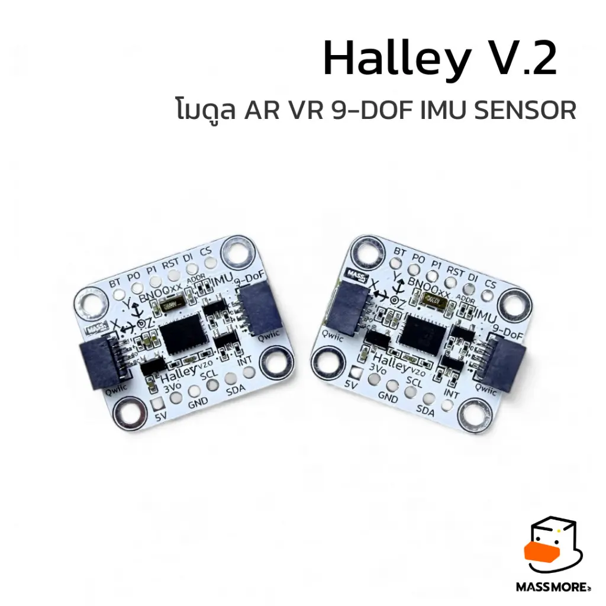
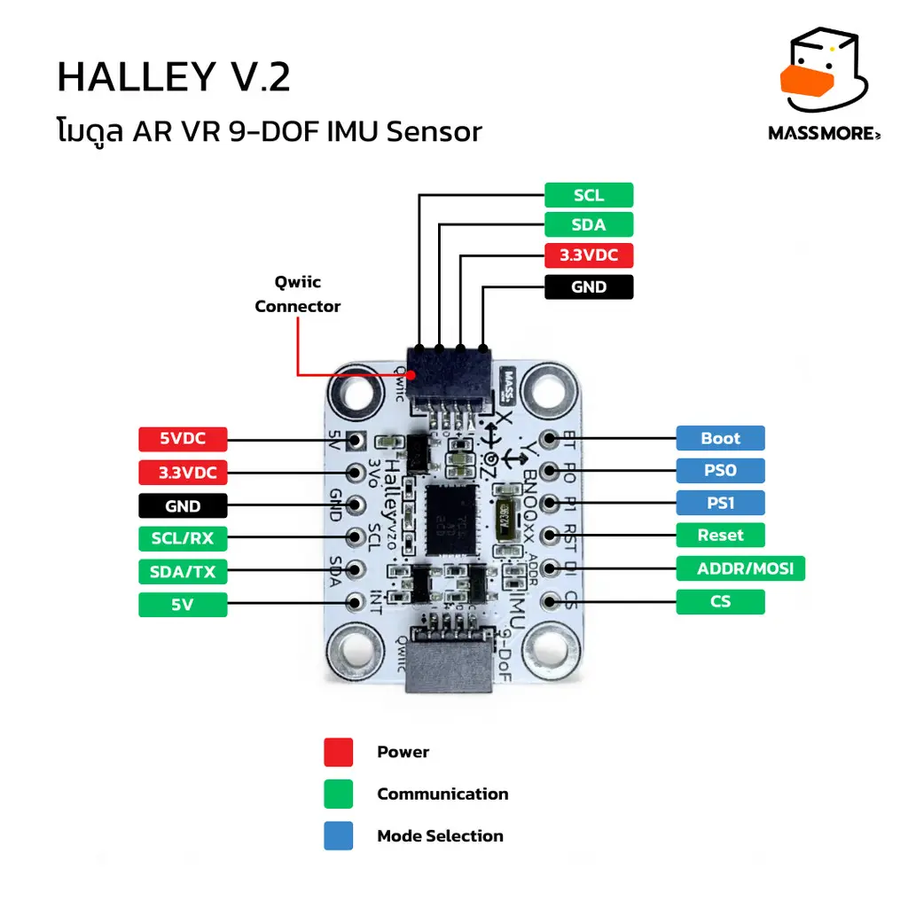
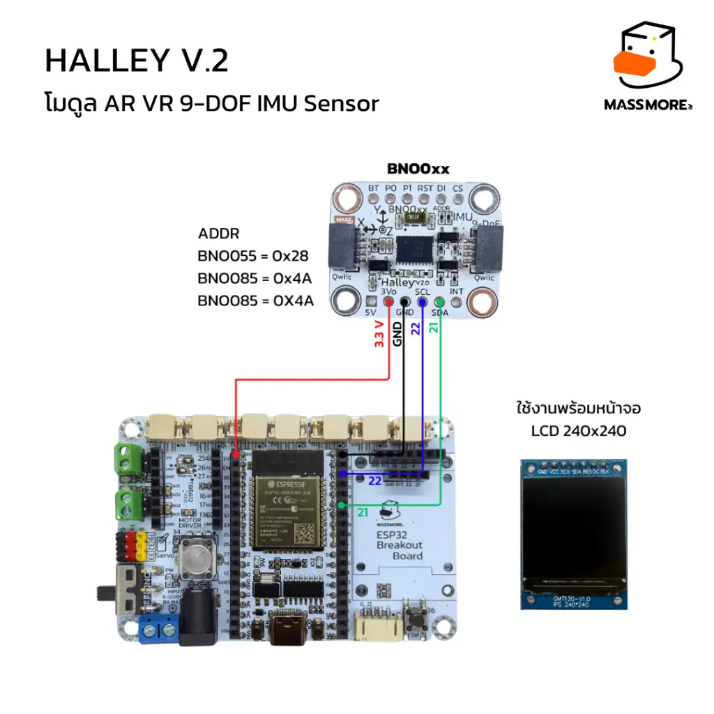

# Massmore_BNO08x

**Massmore Halley V2 — BNO085 / BNO086 9-DOF AR/VR IMU Sensor Module (SKU-1010)**
Arduino IDE / PlatformIO driver library — **Version 2.1.0** by Massmore — *Designed and Manufactured by Massmore*



> **เริ่มต้นเร็วที่สุด:** ต่อ Qwiic / I2C (3.3 V), เปิดตัวอย่าง `01_BasicRead`, address default `0x4A` — เรียก `readAll()` ครั้งเดียวได้ quaternion, roll/pitch/yaw, accel, gyro, mag ครบ

---

## 1. Product Overview

BNO085 / BNO086 เป็น 9-DOF sensor-fusion SiP ที่รวม accelerometer, gyroscope, magnetometer และ MCU
ภายในที่รัน CEVA SH-2 MotionEngine ไว้ในตัวเดียว เซ็นเซอร์คำนวณ orientation ให้เสร็จแล้วส่งเป็น
quaternion / rotation vector ออกมา host MCU จึงไม่ต้องเขียน Kalman / Madgwick filter เอง

**Massmore Halley V2 (SKU-1010) key specs**

| Item | Spec |
|---|---|
| Sensor | BNO085 หรือ BNO086 (CEVA / Bosch), SH-2 MotionEngine |
| Outputs | Rotation Vector (9-axis), Game RV (6-axis), Geomagnetic RV, AR/VR-stabilized RV, Gyro-integrated RV สูงสุด 1 kHz, accel / gyro / mag / linear accel / gravity, step counter, tap / shake / activity classifier |
| Interfaces | I2C (default), SPI (Mode 3, ≤ 3 MHz), UART-SHTP (3 Mbaud), UART-RVC (115200, 100 Hz) |
| I2C address | `0x4A` (default, DI = LOW) / `0x4B` (DI = HIGH) |
| Power input | 3.3 V ที่ pad `3Vo` หรือ 5 V ที่ pad `5V` (on-board 3.3 V LDO regulator) |
| Logic level | 3.3 V — `SDA`/`SCL` มี bidirectional level shifter ต่อกับ host 5 V ได้; ขา signal อื่นเป็น 3.3 V เท่านั้น |
| Pull-up | SDA / SCL มี pull-up บนบอร์ด (ค่าที่ datasheet แนะนำ 2–4 kΩ) |
| Connector | Qwiic-compatible 4-pin connector + through-hole pads |
| Board size | ประมาณ 25.40 × 20.32 mm (ตรวจ mechanical drawing / บอร์ดจริงก่อนออกแบบ enclosure) |

**Library highlights**

- Independent SH-2 / SHTP implementation — ไม่มี external dependency, ไม่ใช้ dynamic allocation, ไม่ hardcode GPIO
- **Dual API:** Simple Blocking API (`readAll()`) สำหรับผู้เริ่มต้น / AVR และ Non-blocking FSM API (`update()` / `isDataReady()` / `getReadings()`) สำหรับ multitask / RTOS
- **Chip identity & authenticity:** `verifyChipID()`, `getSerialNumber()`, `isGenuine()`
- Calibration, tare, Save DCD, FRS read/write, sleep / wake, soft / hardware reset
- Factory Test sketch + pre-compiled firmware สำหรับ Massmore Web Serial Monitor

### What's new in v2.1.0 (2026-09-22)

ทดสอบกับบอร์ดจริง (BNO086) ครบทั้ง 4 โหมดบน ESP32 และ I2C บน ESP32-S3 (MOMO) — ผลอยู่ใน [`docs/Report_v2.1.0_Test_and_Manual_Plan.md`](docs/Report_v2.1.0_Test_and_Manual_Plan.md)

- **ใหม่:** `getChipModel()` / `chipModelToString()` ระบุ BNO085 / BNO086 — Factory Test พิมพ์ `#CHIP BNO086`
- **ใหม่:** ตัวอย่าง `07_UART_Mode` (SHTP-over-UART 3 Mbit/s) · Factory Test ย้ายเป็น `08_Factory_Test`
- **Fix I2C:** ค่ามุมเพี้ยนเป็นครั้งคราว (quaternion real ≈ 0) เมื่อ packet ยาวกว่าหนึ่ง chunk แล้วชิปตอบ header ว่าง
- **Fix I2C:** `begin()` ลอง probe ซ้ำเมื่อชิป NACK ครั้งแรก · ตรวจ bus ค้าง (SDA/SCL LOW) แล้วแจ้ง `Bus I/O error` ทันทีแทนการค้าง ~20 s
- **Fix:** FW version ที่รายงานคงที่ทุก reset (เลือก firmware image ที่รู้จักตัวแรก)
- **Fix UART:** ต่อ `INT` แล้วอ่านไม่ได้เลย · `readAll()` timeout ~50% หลัง `delay()` เพราะ RX buffer ล้น
- **Fix SPI:** `beginSPI()` บังคับขา WAKE (`P0`) — ต่อ `P0` เข้า `3Vo` ตรง ๆ ชิปรับคำสั่งไม่ได้
- ตัวอย่าง ESP32 ใช้ `RST` = GPIO 17 (กู้ bus ค้างเองได้) · ESP32-S3 ใช้ขาของบอร์ด MOMO (SDA 14 / SCL 15)

---

## 2. Pinout



ชื่อขาคือชื่อที่พิมพ์บนบอร์ด — โค้ดและเอกสารทั้งชุดใช้ชื่อบนบอร์ดเป็นหลัก

| Pad | CEVA name | Function | Notes |
|---|---|---|---|
| `5V` | — | Power in 5 V | ผ่าน on-board 3.3 V LDO |
| `3Vo` | VDD / VDDIO | 3.3 V in / out | จ่าย 3.3 V เข้าตรงนี้ได้ หรือดึง 3.3 V ออกไปใช้ (กระแสต่ำ) |
| `GND` | GND | Ground | |
| `SDA` | SDA · TX (UART) · MISO (SPI) | I2C data | ผ่าน level shifter, pull-up บนบอร์ด |
| `SCL` | SCL · RX (UART) · SCK (SPI) | I2C clock | ผ่าน level shifter, pull-up บนบอร์ด |
| `INT` | H_INTN | Data ready, active-low | 3.3 V logic — แนะนำให้ต่อ |
| `RST` | NRST | Reset, active-low | 3.3 V logic |
| `DI` | SA0 / ADDR (I2C) · MOSI (SPI) | Address select / SPI MOSI | ปล่อยลอย = `0x4A`, ต่อ `3Vo` = `0x4B` — 3.3 V เท่านั้น |
| `CS` | H_CSN | SPI chip select | 3.3 V เท่านั้น |
| `BT` | BOOTN | Bootloader select | **ห้ามดึง LOW ตอน reset** (จะเข้า DFU bootloader ที่ 0x28/0x29) |
| `P0` | PS0 | Protocol select bit 0 · WAKE ในโหมด SPI | 3.3 V เท่านั้น |
| `P1` | PS1 | Protocol select bit 1 | 3.3 V เท่านั้น |

| Mode | `P1` | `P0` |
|---|---|---|
| I2C (default) | 0 | 0 |
| SPI | 1 | 1 |
| UART-SHTP | 1 | 0 |
| UART-RVC | 0 | 1 |

`P0` / `P1` ถูกอ่านตอนปล่อย `RST` เท่านั้น — เปลี่ยนโหมดแล้วต้อง reset



---

## 3. MCU Compatibility & Limitation Matrix

| MCU Platform | Tested Core / Toolchain | Bus Remapping Support | Limitations / Notes |
|---|---|---|---|
| **ESP32-S3** | Arduino-ESP32 v3.x+ (Arduino IDE Core 3.3.12 / pioarduino 55.03.311 = Core 3.3.11) | Full GPIO Matrix | None. Recommended for high-rate data (SPI 400 Hz+). |
| **ESP32 (Classic)** | Arduino-ESP32 v3.x+ (Arduino IDE Core 3.3.12 / pioarduino 55.03.311 = Core 3.3.11) | Full GPIO Matrix | None. **Primary Factory Test target.** |
| **AVR — Arduino Nano (ATmega328P)** | Arduino AVR Core | Fixed Hardware Pins (I2C: A4/A5, SPI: D10–13, UART: D0/D1) | 2 KB SRAM / 32 KB Flash — driver ใช้ SRAM ~1 KB (packet buffer ลดเหลือ 128 byte อัตโนมัติ) ใช้ Simple API, หลีกเลี่ยง buffer ใหญ่ใน sketch. 5 V logic — ต่อได้เฉพาะ `SDA`/`SCL` (มี level shifter); ขา `INT`/`RST`/`DI`/`CS`/`P0`/`P1` ต้องผ่าน level shifter. |

**Hardware-tested (2026-09-22, BNO086 FW 3.12.6, Arduino-ESP32 2.0.17 ผ่าน Arduino IDE):**

| MCU | I2C | SPI | UART-SHTP | UART-RVC |
|---|---|---|---|---|
| ESP32 DevKit | PASS (01–04, 08) | PASS ~400 Hz | PASS | PASS |
| ESP32-S3 MOMO | PASS (01, 08) | — | — | — |
| Arduino Nano | compile only | compile only | ไม่รองรับ (3 Mbaud) | compile only |

Compile matrix (v2.1.0): 8 ตัวอย่าง × 3 บอร์ด ผ่านทั้ง **Arduino IDE (ESP32 Core 3.3.12, AVR 1.8.8)** และ **PlatformIO (`esp32dev`, `esp32-s3-devkitc-1`, `nano`)** — 48/48 build, ไม่มี warning จากไลบรารี (`-Wall -Wextra`)
คอร์อื่น (RP2040, STM32) ไม่มี platform-specific code จึงน่าจะ compile ได้ แต่ **ไม่ได้ทดสอบและไม่รับประกัน**

---

## 4. Installation

### Arduino IDE

1. ดาวน์โหลด [`ArduinoIDE/Massmore_BNO08x.zip`](ArduinoIDE/Massmore_BNO08x.zip)
2. **Sketch → Include Library → Add .ZIP Library…** เลือกไฟล์ ZIP
3. **File → Examples → Massmore_BNO08x → 01_BasicRead**
4. ESP32: ติดตั้ง board package *esp32 by Espressif Systems* **v3.x ขึ้นไป** จาก Boards Manager

### PlatformIO (VS Code)

1. **File → Open Folder…** เปิดโฟลเดอร์ [`PlatformIO/`](PlatformIO/)
2. เลือก environment (`esp32dev` default, `esp32-s3-devkitc-1`, `nano`) แล้วกด **Build / Upload / Monitor**

ไม่ต้องติดตั้งอะไรเพิ่ม — ไลบรารี vendor ไว้ใน `PlatformIO/lib/Massmore_BNO08x/` และ `platformio.ini` pin pioarduino ไว้ให้ได้ Arduino-ESP32 Core 3.x

---

## 5. Quick Start Code

```cpp
#include <Wire.h>
#include <Massmore_BNO08x.h>

Massmore_BNO08x imu;

void setup() {
  Serial.begin(115200);
  Wire.begin(21, 22);            // ESP32: sketch เป็นคนกำหนดขา (Nano: Wire.begin();)
  Wire.setClock(100000);         // BNO08x ใช้ clock stretching — 100 kHz เสถียรที่สุด

  if (!imu.begin(0x4A, Wire)) {  // ไม่พบ 0x4A จะลอง 0x4B ให้เอง
    Serial.println(Massmore_BNO08x::statusToString(imu.lastError()));
    while (true) delay(100);
  }
}

void loop() {
  Massmore_BNO08x_reading_t r;
  if (imu.readAll(r)) {          // Blocking: ได้ครบ quaternion / Euler / accel / gyro / mag
    Serial.print("heading="); Serial.print(r.headingDeg, 1);
    Serial.print(" roll=");   Serial.print(r.eulerDeg.roll, 1);
    Serial.print(" pitch=");  Serial.println(r.eulerDeg.pitch, 1);
  }
  delay(100);
}
```

ผลใน Serial Monitor (115200):

```text
heading=87.3 roll=-0.4 pitch=1.2
heading=87.4 roll=-0.4 pitch=1.2
```

---

## 6. Pin Mapping Examples

**ESP32 (Classic) — Arduino-ESP32 Core 3.x, custom GPIO**

```cpp
Wire.begin(21, 22);                 // SDA, SCL — ย้ายได้ทุกขาผ่าน GPIO Matrix
imu.begin(0x4A, Wire, /*INT*/ 4, /*RST*/ 17);   // RST แนะนำ: driver reset ชิปเองถ้า bus ค้าง
```

**ESP32-S3 (MOMO by Massmore) — bus ที่สอง (Wire1) บนขาที่เลือกเอง**

```cpp
Wire1.begin(14, 15, 100000);        // SDA, SCL, frequency
imu.begin(0x4A, Wire1);
```

**Arduino Nano (ATmega328P) — hardware I2C ขาตายตัว**

```cpp
Wire.begin();                       // A4 = SDA, A5 = SCL (fixed)
Wire.setClock(100000);
imu.begin(0x4A, Wire, /*INT*/ 2);   // INT ผ่าน level shifter (Nano เป็น 5 V logic)
```

**SPI (ESP32)** — `SPI.begin(18, 19, 23, 5); imu.beginSPI(/*CS*/5, /*INT*/4, /*RST*/17, /*WAKE*/16, SPI, 3000000);`
(`P0` ต้องต่อ GPIO WAKE — ห้ามต่อ `3Vo` ตรง ๆ, `P1` ต่อ `3Vo`)
**UART-SHTP (ESP32)** — `Serial2.setRxBufferSize(1024); Serial2.begin(3000000, SERIAL_8N1, 21, 22); imu.beginUART(Serial2, /*INT*/4, /*RST*/17);`
(pad `SDA` = TX ของเซ็นเซอร์ → GPIO 21, pad `SCL` = RX ← GPIO 22)
**UART-RVC (ESP32)** — `Serial1.begin(115200, SERIAL_8N1, 21, 22); rvc.begin(Serial1);` (pad `SDA` → GPIO 21)

---

## 7. API Reference

### Start-up

| Function | Description | Return |
|---|---|---|
| `begin(addr, TwoWire&, intPin=-1, rstPin=-1)` | เริ่มต้นบน I2C (sketch เรียก `Wire.begin()` เอง) ไม่พบ addr จะลอง 0x4A/0x4B อีกตัวให้ | `bool` |
| `beginSPI(cs, int, rst, wake, SPIClass&, hz)` | เริ่มต้นบน SPI Mode 3 — CS, INT, RST และ **WAKE จำเป็นทั้งหมด** (ขาด = `ERR_BAD_PARAM`) | `bool` |
| `beginUART(Stream&, intPin=-1, rstPin=-1)` | SHTP over UART 3 Mbaud | `bool` |
| `getI2CAddress()` | address ที่พบจริง | `uint8_t` |
| `lastError()` | error code ล่าสุด (`MASSMORE_BNO08X_OK`, `_ERR_TIMEOUT`, `_ERR_NO_DEVICE`, `_ERR_WRONG_ID`, …) | `Massmore_BNO08x_status_t` |
| `statusToString(code)` | ข้อความอ่านง่ายของ error code | `const char*` |

### Simple Blocking API

| Function | Description | Return |
|---|---|---|
| `readAll(reading_t&, timeoutMs=300)` | อ่านครบชุด (RV + accel + gyro + mag) — enable ให้เองที่ 50 Hz ถ้ายังไม่เปิด | `bool` |
| `readEulerDeg(euler_t&, timeoutMs)` | roll / pitch / yaw เป็นองศา | `bool` |
| `readHeadingDeg(timeoutMs)` | heading 0..360° | `float` หรือ `NAN` |
| `waitForReport(sensorId, timeoutMs)` | รอ report ชนิดใดชนิดหนึ่ง (rollover-safe `millis()`) | `bool` |

### Non-blocking FSM API

| Function | Description | Return |
|---|---|---|
| `enableRotationVector(us)` … `enableXxx(us)` | เปิด report — argument เป็น **คาบเวลา microseconds** (10000 = 100 Hz) | `status_t` |
| `update()` | ดึง packet หนึ่งชุดถ้ามี — ไม่ block | `bool` |
| `updateAll(max=16)` | ดึงทุก packet ที่ค้าง (มี budget) | `uint8_t` |
| `isDataReady(sensorId)` / `isDataReady()` | มี report ใหม่หรือไม่ (ไม่ล้าง flag) | `bool` |
| `hasNewReport(sensorId)` | test-and-clear flag report ใหม่ | `bool` |
| `getReadings(reading_t&)` | คัดลอกค่าล่าสุดทั้งหมด (ไม่แตะ bus) | `void` |
| `getQuaternion()`, `getEulerDeg()`, `getHeadingDeg()`, `getAccel()`, `getGyro()`, `getMag()`, `getLinearAccel()`, `getGravity()` | getter ค่าล่าสุด | struct / `float` |
| `getAccuracy(sensorId)` | accuracy 0..3 ของ sensor นั้น | `accuracy_t` |
| `setReportCallback(cb, ctx)` | callback ต่อ report | `void` |

### Identity / authenticity

| Function | Description | Return |
|---|---|---|
| `getChipModel()` / `chipModelToString()` | รุ่นชิป `BNO085` / `BNO086` / `BNO08x` (จาก part number และ report ที่ชิปประกาศ) | `chip_t` / `const char*` |
| `verifyChipID()` | Product ID (0xF8) part number ตรง SH-2 build ที่รู้จัก (BNO08x ไม่มี WHO_AM_I register) | `bool` |
| `getSerialNumber()` | serial จาก FRS 0x4B4B (32 bit ล่าง; 0 = ไม่ได้ program) | `uint32_t` |
| `readSerialNumber(uint64_t&)` | serial 64 bit เต็ม | `status_t` |
| `isGenuine()` | heuristic รวม: Product ID + version + part number / MotionEngine metadata Q14/12 | `bool` |
| `verifyChip()` / `getLastAuthResult()` | ผลละเอียด (`AUTH_OK`, `AUTH_UNKNOWN_FW`, `AUTH_NO_RESPONSE`, …) | `auth_t` |
| `verifyMotionEngine()` | Rotation Vector metadata Q point = 14/12 | `bool` |

### Calibration / tare / power

| Function | Description |
|---|---|
| `calibrateAll()`, `calibrateMagnetometer()`, `endCalibration()` | dynamic calibration ตาม CEVA 1000-4044 |
| `saveCalibration()`, `clearCalibrationAndReset()` | Save DCD ลง flash / ลบแล้ว reset |
| `tareNow(axes, basis)`, `persistTare()`, `clearTare()` | tare ตาม CEVA 1000-4045 |
| `softReset()`, `hardwareReset()`, `modeSleep()`, `modeOn()`, `wake()` | reset / power |
| `readFrsRecord()`, `writeFrsRecord()`, `readSensorMetadata()` | Flash Record System |

`Massmore_BNO08x_RVC` (ใน `Massmore_BNO08x_RVC.h`): `begin(Stream&)`, `read(rvc_report_t&)`, `getChecksumErrors()` สำหรับโหมด UART-RVC

---

## 8. Examples

| # | Example | Description |
|---|---|---|
| 01 | `01_BasicRead` | Simple Blocking API — `readAll()` พิมพ์ทุกค่า (I2C default) |
| 02 | `02_CustomPins_BusRemap` | ESP32 / S3: `Wire1` บนขาที่เลือกเอง (Core 3.x) · Nano: A4/A5 fixed |
| 03 | `03_NonBlocking_Multitask` | FSM API + LED blink + loop counter — แสดงว่า `loop()` ไม่ถูก block |
| 04 | `04_Calibration_Tare` | calibration ตามขั้นตอน CEVA, Save DCD, tare / persist / clear |
| 05 | `05_SPI_Advance` | SPI Mode 3 @ 3 MHz, Rotation Vector 400 Hz + วัดอัตราจริง |
| 06 | `06_UART_RVC` | โหมด UART-RVC 100 Hz แบบสายเส้นเดียว (`Massmore_BNO08x_RVC`) |
| 07 | `07_UART_Mode` | SHTP-over-UART 3 Mbit/s (`beginUART()`) — API เต็มเหมือน I2C · ESP32 / S3 เท่านั้น |
| 08 | `08_Factory_Test` | **Outgoing QA** — bus scan, Product ID, serial, authenticity, range check, continuous read → `#VERDICT` |

ทุกตัวอย่างไม่มี dependency ภายนอก และ build ผ่านทั้ง `esp32dev`, `esp32-s3-devkitc-1`, `nano`

---

## 9. Factory Test & Web Serial Monitor

`08_Factory_Test` รันเองหลังบูตและพิมพ์ผลแบบ machine-parsable ที่ 115200:

```text
#MASSMORE_FACTORY_TEST v1.0
#PRODUCT Massmore_BNO08x
#MCU ESP32
#RESULT BUS_SCAN PASS 0x4A
#RESULT CHIP_ID PASS 10004563
#CHIP BNO086
#RESULT FW_VERSION PASS 3.12.6
#RESULT SERIAL PASS NONE
#RESULT METADATA PASS Q14/12
#RESULT AUTHENTICITY PASS GENUINE
#RESULT RANGE_ACCEL PASS 9.61
#RESULT RANGE_GYRO PASS 0.000
#RESULT RANGE_MAG PASS 48.9
#RESULT RANGE_QUAT PASS 1.000
#RESULT CONTINUOUS PASS 20/20
#VERDICT PASS
[PASS] SENSOR QA PASSED - READY TO SHIP
```

(ผลจริงจากบอร์ด BNO086 บน ESP32 DevKit, 2026-09-22) — `#CHIP` เป็นข้อมูลเท่านั้น ไม่ใช่เงื่อนไข PASS/FAIL

เฟิร์มแวร์สำเร็จรูป, วิธี flash (esptool / PlatformIO / web) และรายงานที่คาดหวังอยู่ที่ [`firmware/README.md`](firmware/README.md)

---

## 10. Troubleshooting

| อาการ | ตรวจ |
|---|---|
| `No device found` | ไฟ 3.3 V + GND ร่วม, SDA/SCL ไม่สลับ, ขาในโค้ดตรงกับสายจริง, `BT` ไม่ถูกดึง LOW |
| พบที่ 0x28 / 0x29 | ชิปอยู่ใน bootloader — ปล่อย `BT` ลอยแล้ว reset |
| ข้อมูลกระตุก / หยุด | ลด I2C เหลือ 100 kHz, ต่อ `INT`, อย่าพิมพ์ Serial ทุก report, ใช้ SPI สำหรับอัตราสูง |
| yaw ดริฟต์ / กระโดด | Rotation Vector ใช้ magnetometer — calibrate ในตำแหน่งติดตั้งจริง หรือใช้ Game Rotation Vector |
| `Bus I/O error` / SDA-SCL อ่านได้ LOW ค้าง | MCU ถูก reset ขณะชิปส่งข้อมูล → ชิปกด bus ไว้ · ต่อ `RST` แล้วส่ง `rstPin` ให้ `begin()` หรือถอดไฟเซ็นเซอร์ |
| เปลี่ยน `P0`/`P1` แล้วโหมดไม่เปลี่ยน | โหมดถูกอ่านตอน reset เท่านั้น — ต่อ `RST` (ตัวอย่าง reset ให้) หรือถอดไฟเซ็นเซอร์ |
| SPI: `No device found` ทั้งที่อ่าน advertisement ได้ | `P0` ต่อ `3Vo` ตรง ๆ — ต้องต่อ GPIO แล้วส่งเป็น `wakePin` |
| UART-SHTP: ไม่ตอบ | `P1`=HIGH `P0`=LOW, pad `SDA` → RX ของ MCU, pad `SCL` ← TX ของ MCU, 3,000,000 baud, `setRxBufferSize()` ก่อน `begin()` |
| ESP32 upload `Invalid head of packet` | ลด upload speed เป็น 460800 |
| Nano upload ไม่ขึ้น | ลอง `board = nanoatmega328` (bootloader เก่า 57600) ใน `platformio.ini` |

---

## 11. Where to Buy

- massmore.shop: <https://www.massmore.shop/products/2141d3bf-9d0f-4837-badf-a36bcda61638>
- บทความ / คู่มือสินค้า: <https://www.massmore.shop/docs/28>
- Shopee: <https://shopee.co.th/i.5641091.49802229903>
- Lazada: <https://www.lazada.co.th/products/i4774958834.html>

**References:** [BNO08X Datasheet](https://www.ceva-ip.com/wp-content/uploads/BNO080_085-Datasheet.pdf) · [BNO080/085 Product Brief](https://www.ceva-ip.com/wp-content/uploads/BNO080_085-Product-Brief.pdf) · [SH-2 Reference Manual](https://www.ceva-ip.com/wp-content/uploads/SH-2-Reference-Manual.pdf)

---

## 12. License

MIT License © 2026 Massmore Biz Co., Ltd. — see [`ArduinoIDE/Massmore_BNO08x/LICENSE`](ArduinoIDE/Massmore_BNO08x/LICENSE)

Massmore · [www.massmore.shop](https://www.massmore.shop)
